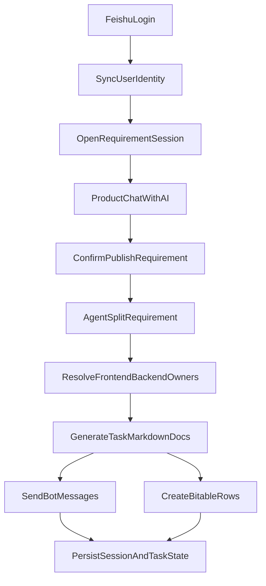

# AI 驱动需求交付流程引擎实施方案

## 目标

输出一份详细功能设计文档，作为后续分步开发的唯一基线。该文档建议落在 `docs/requirement-delivery-engine.md`，并以现有仓库为基础扩展：前端沿用 `[/Users/mac165/Projects/Feishu-Pipeline/apps/web/src/App.tsx](/Users/mac165/Projects/Feishu-Pipeline/apps/web/src/App.tsx)`，后端以 `[/Users/mac165/Projects/Feishu-Pipeline/apps/api-go/main.go](/Users/mac165/Projects/Feishu-Pipeline/apps/api-go/main.go)` 为起点重构，飞书应用配置延续 `[/Users/mac165/Projects/Feishu-Pipeline/apps/app.manifest.json](/Users/mac165/Projects/Feishu-Pipeline/apps/app.manifest.json)`。

## 先修正的产品与架构约束

- 不建议只靠“当前部门名称”做权限判断。应设计为“飞书身份同步 + 系统内角色映射 + 需求创建时负责人快照”，否则人员转岗或调部门后会导致历史需求权限漂移。
- 不建议把所有动作都做成单次大模型调用。应拆成确定性工作流：需求理解、任务拆分、负责人匹配、文档生成、消息发送、排期建表分别执行，失败可重试、可审计。
- 不建议直接把“聊天内容”当正式需求入库。应加一个“发布需求”动作，只有产品角色在确认后才触发任务创建与飞书分发。
- 原型期使用 `SQLite` 没问题，但从代码结构上必须抽象 `repository` 层，后续可平滑迁移到 PostgreSQL。
- 飞书消息发送优先走“应用机器人”身份，而不是“代用户发消息”，这样权限边界更清晰、实现更稳定。
- 多维表格建议只维护一张“需求主排期表”，每一行代表一个子任务；需求明细文档与聊天会话使用链接关联，不要把长篇需求正文塞进表格单元格。

## 总体技术路线

- 前端：React + Vite，提供飞书登录入口、需求会话列表、聊天窗口、需求详情页、任务状态页。
- 后端：Go 1.23+，使用标准库 `net/http` 和 Go 1.22+ `ServeMux`，按 REST API 提供认证、会话、需求、任务、消息、知识库检索接口。
- Agent 编排：使用 `Eino` 实现模型调用、工作流拆解、知识检索增强、任务文档生成。
- 飞书能力：OAuth 登录、联系人/部门查询、机器人消息发送、云文档/文档内容写入、多维表格建表与更新。
- 数据存储：SQLite 保存用户映射、角色快照、需求会话、聊天记录、任务记录、文档链接、消息发送记录、排期状态。
- 知识增强：企业规范以“飞书知识库/云文档同步到本地索引”的方式做 RAG，避免在线检索链路过重。

## 建议的系统模块

- `apps/web`：Web 前端，负责登录态、聊天 UI、会话隔离、任务查看。
- `apps/api-go/cmd/server`：Go 服务启动入口。
- `apps/api-go/internal/http`：HTTP 路由、鉴权、中间件、请求响应。
- `apps/api-go/internal/feishu`：飞书 SDK 封装，统一处理 access token、联系人、消息、文档、多维表格。
- `apps/api-go/internal/agent`：Eino 图编排，负责需求拆解、RAG、回答生成、任务 markdown 输出。
- `apps/api-go/internal/store`：SQLite repository 层。
- `apps/api-go/internal/domain`：需求、任务、会话、角色、消息等领域模型。
- `apps/api-go/internal/job`：异步任务执行器，处理需求发布后的后台工作流。
- `packages/shared`：前后端共享类型，如会话摘要、任务状态枚举、API DTO。

## 核心角色与权限模型

- 产品角色：可创建需求会话、在会话中整理需求、点击发布需求、查看全部拆解结果与排期。
- 前端负责人：只能访问自己被分配的需求会话与任务明细，可在会话中追问需求细节。
- 后端负责人：同上。
- 管理员：用于配置部门映射、角色映射、默认排期规则、知识库同步来源。

权限规则不直接写死成“部门名等于产品部/研发部”，而是：

- 登录后从飞书获取用户资料与部门列表。
- 后端按“部门映射规则 + 职级/岗位关键词 + 人工覆盖表”计算系统角色。
- 在需求发布时，把前后端负责人写入 `requirement_assignees_snapshot`，以后即使用户换部门，也不影响历史权限。

## 关键业务流程

## 会话设计

- 每个“需求”就是一个顶层会话线程，类似 ChatGPT 左侧会话列表。
- 会话状态至少包含：`draft`、`published`、`in_delivery`、`testing`、`done`、`archived`。
- 草稿阶段允许产品持续与 AI 反复打磨需求。
- 发布后冻结一版“需求摘要”和“任务拆解结果”，但聊天仍可继续，后续对话作为补充说明而不是覆盖原任务。
- 前后端负责人进入同一需求会话时，只能看到该需求上下文与自己有权限的任务信息。

## Agent 编排建议

使用 `Eino` 定义一个可观测的多节点工作流，而不是单 Agent 黑盒：

- `RequirementNormalizerNode`：把产品自然语言整理为结构化需求。
- `RAGEnhanceNode`：若涉及企业规范、接口约束、UI 规范，则先检索知识库片段增强上下文。
- `TaskSplitNode`：拆成前端任务、后端任务、公共依赖、验收标准、风险点。
- `AssigneeResolverNode`：根据飞书部门成员、角色映射、负载规则匹配负责人。
- `MarkdownWriterNode`：分别生成前端/后端任务文档 markdown。
- `BitableRowPlannerNode`：生成多维表格行数据。
- `ResponseComposerNode`：给产品返回发布结果摘要，给研发返回需求解释答案。

对于研发人员的追问，不重新执行完整拆分流程，而是走轻量链路：

- 加载该需求会话历史。
- 加载需求正式摘要、拆分结果、本人任务文档。
- 必要时触发 RAG 检索。
- 由回答链输出“该需求细节解释”。

## 飞书集成设计

### 1. Web 飞书登录

- 使用飞书网页应用 OAuth 授权登录。
- 登录成功后后端换取用户身份，拉取用户基础资料与部门信息。
- 后端签发自己的 session/JWT，前端后续只用访问本系统 API。

### 2. 联系人与部门同步

- 首次登录时同步本人资料。
- 发布需求时再查询候选产品/前端/后端成员，避免长期缓存过期。
- 维护系统配置表：部门名到业务角色的映射，避免把“前端部”“客户端部”“Web 平台部”等名称写死在代码里。

### 3. 机器人消息发送

- 每位负责人先收到一条提醒消息：`您有一条新的需求任务`。
- 再发送对应任务文档链接或文档卡片。
- 所有发送结果记录到 `message_deliveries`，失败可重试。

### 4. 文档与多维表格

- 任务文档推荐一人一文档，文档标题包含需求编号、角色、负责人。
- 多维表格至少包含字段：需求编号、需求标题、子任务类型、负责人、计划开始、计划结束、排期天数、状态、文档链接、最近更新时间。
- 状态枚举统一为：`未开发`、`正在开发`、`已提测`、`完成`。
- 后续研发状态更新可以先在 Web 内修改，再由后端同步回多维表格，避免把所有状态流转入口都放在飞书侧。

## RAG 与企业规范扩展

你的扩展方向是合理的，但建议做成二期：

- 一期先支持“手工配置知识源文档 ID + 定时同步”。
- 将飞书知识库文档切分后入本地索引，原型期可使用 SQLite FTS 或本地向量索引；代码上预留替换接口。
- 对话时只有当问题命中“未知规范、接口约束、设计规范、提测流程”等意图，才触发检索增强，避免每轮对话都拉高延迟与成本。
- 回答中应注明参考的知识片段来源，提升可追溯性。

## 建议的数据模型

- `users`：本系统用户与飞书用户映射。
- `user_departments`：用户当前部门快照。
- `role_bindings`：角色映射与人工覆盖规则。
- `sessions`：需求会话主表。
- `messages`：聊天消息历史。
- `requirements`：正式发布后的需求版本快照。
- `tasks`：前端/后端子任务。
- `task_docs`：飞书文档链接与元数据。
- `bitable_records`：多维表格记录映射。
- `message_deliveries`：机器人消息发送记录。
- `knowledge_sources` / `knowledge_chunks`：RAG 知识分片与索引元数据。

## API 设计草案

建议先实现以下 REST API：

- `GET /api/health`
- `GET /api/auth/feishu/login`
- `GET /api/auth/feishu/callback`
- `GET /api/me`
- `GET /api/sessions`
- `POST /api/sessions`
- `GET /api/sessions/{sessionID}`
- `POST /api/sessions/{sessionID}/messages`
- `POST /api/sessions/{sessionID}/publish`
- `GET /api/tasks/{taskID}`
- `PATCH /api/tasks/{taskID}/status`
- `POST /api/admin/role-mappings`
- `POST /api/admin/knowledge/sync`

其中聊天消息接口分两类：

- 草稿需求对话：产品和 AI 打磨需求。
- 已发布需求问答：研发围绕当前需求做澄清，不允许隐式改写正式拆解结果。

## 前端页面建议

- 登录页：飞书授权登录。
- 会话主页：左侧需求会话列表，右侧聊天框。
- 需求详情抽屉：展示需求摘要、前后端任务、负责人、文档链接、排期状态。
- 我的任务页：当前登录研发人员查看自己负责的任务与状态。
- 管理配置页：角色映射、知识库来源、默认排期规则。

## 迭代顺序

### Phase 1：最小可用闭环

- 飞书登录。
- 产品创建会话并对话。
- 产品点击发布需求。
- 后端用 Eino 拆出前端/后端任务。
- 自动生成 markdown 文本并保存。
- 通过机器人发提醒消息。
- 在系统内展示任务和状态。

### Phase 2：飞书文档与多维表格落地

- 创建飞书文档。
- 推送文档链接给负责人。
- 创建或写入需求排期多维表格。
- Web 修改状态并同步表格。

### Phase 3：RAG 与治理增强

- 规范文档同步。
- 检索增强问答。
- 失败重试、审计日志、回调监控。
- 管理后台配置化。

## 结合现有仓库的具体落地方向

- 保留 `apps/web` 作为正式前端，不再继续扩展 `apps/api-ts` 与 `apps/api-py`，它们可作为实验目录保留，但不纳入主链路。
- `apps/api-go/main.go` 当前是飞书 API 调研样例，后续应拆成标准 Go 服务目录，并改为使用飞书 Go SDK而非手写裸请求，这也符合你“API 部分主要使用飞书开放文档 API 的 Go SDK”的要求。
- `README.md` 当前偏单一接口说明，后续可改成项目总览，并把详细设计放到 `docs/`。

## 开发时的关键实现原则

- 所有飞书接口调用统一封装，避免 token、错误码、分页逻辑散落业务层。
- 所有 Agent 输出都必须经过结构化校验再入库，不能直接信任模型文本。
- 需求发布流程改为异步 job，前端先拿到“已受理”状态，再轮询或流式查看处理进度。
- 任务分配需要记录“分配依据”，例如部门、角色、关键字匹配或人工指定，方便审计。
- 文档生成要区分“正式版”和“补充说明”，避免会话后续对话污染正式交付件。

## 对应参考

- 飞书开放平台智能助手与服务端 API 说明：[https://open.feishu.cn/document/ukTMukTMukTM/ukDNz4SO0MjL5QzM/AI-assistant-code-generation-guide](https://open.feishu.cn/document/ukTMukTMukTM/ukDNz4SO0MjL5QzM/AI-assistant-code-generation-guide)
- Eino 框架仓库：[https://github.com/cloudwego/eino](https://github.com/cloudwego/eino)
- Eino 示例仓库：[https://github.com/cloudwego/eino-examples](https://github.com/cloudwego/eino-examples)

## 下一步执行方式

确认该方案后，下一轮就按下面顺序开始真正落地：

1. 先创建 `docs/requirement-delivery-engine.md`，把上述方案固化成详细文档。
2. 重构 `apps/api-go` 为正式 Go 服务骨架，接入 `ServeMux`、配置、SQLite、飞书 SDK、Eino。
3. 扩展 `apps/web`，先完成飞书登录和 ChatGPT 风格会话 UI。
4. 再逐步实现“发布需求 -> 拆解 -> 文档 -> 机器人消息 -> 多维表格”的闭环。

